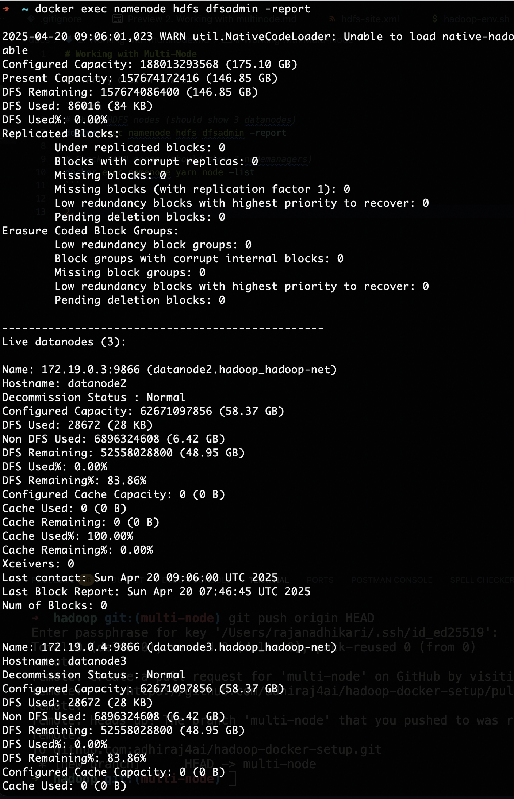
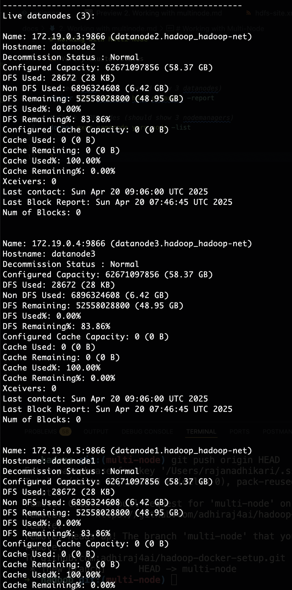
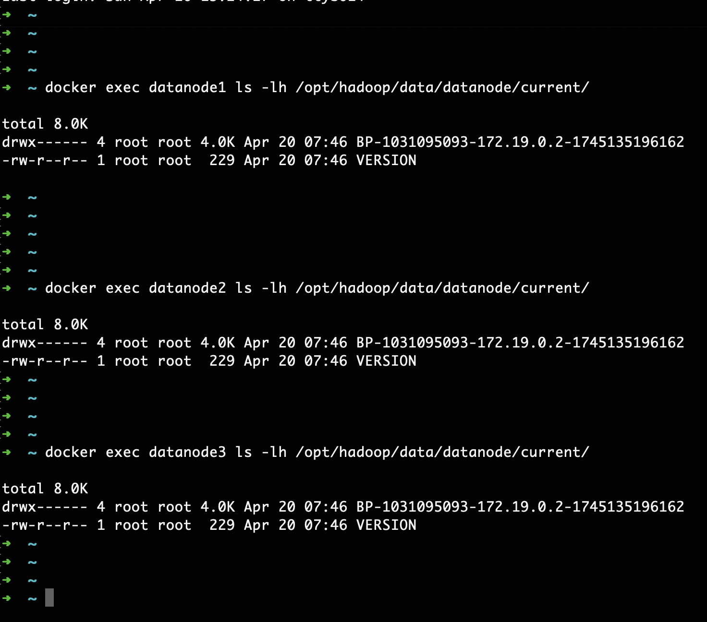

# Working with Multi-Node

1. Verify Cluster Status

```bash
# Check HDFS nodes (should show 3 datanodes)
docker exec namenode hdfs dfsadmin -report

# Check YARN nodes (should show 3 nodemanagers)
docker exec namenode yarn node -list
```



here's the status of all three data nodes:



2. HDFS Replication
Let's now check for the hdfs replication by creating a sample file:


i) First create necessary directories
```bash
# 1. Enter the NameNode container
docker exec -it namenode bash

# 2. Create directory structure in HDFS (run these INSIDE the container)
hdfs dfs -mkdir -p /user/root/input
hdfs dfs -mkdir -p /user/root/output
hdfs dfs -chown -R root:root /user/root
hdfs dfs -chmod -R 755 /user

# 3. Verify directories
hdfs dfs -ls -R /user
```

ii) Now, let's create files:
```bash
# Create sample data file
echo -e "apple orange banana\napple grape\nbanana mango" > fruits.txt

# Put file into HDFS
hdfs dfs -put fruits.txt /user/root/input/

# Verify file with replication
hdfs fsck /user/root/input/fruits.txt -files -blocks -locations
```
You should see output something like this:

<image src="images/file-status-check.png" width="700"/>

iii) Now, let's check file distribution within all three data nodes from your terminal:

```bash
# Check physical storage on each datanode
docker exec datanode1 ls -lh /opt/hadoop/data/datanode/current/
docker exec datanode2 ls -lh /opt/hadoop/data/datanode/current/
docker exec datanode3 ls -lh /opt/hadoop/data/datanode/current/
```
For each datanode you should see the existance of files we created above.



iv) Let's now access the data we have created:

```bash
docker exec namenode hdfs dfs -cat /user/root/input/fruits.txt
```

v) Now, turn off one datanode and check the accessibility of data file:
```bash
# Stop first datanode
docker stop datanode1

# Verify data accessibility (should still work)
docker exec namenode hdfs dfs -cat /user/root/input/fruits.txt

# Check reduced replication (now 2 replicas)
docker exec namenode hdfs fsck /test-replicated.txt -files -blocks -locations
```

You should be able to access the data file. This illustrates the fault tolerance in hadoop. 