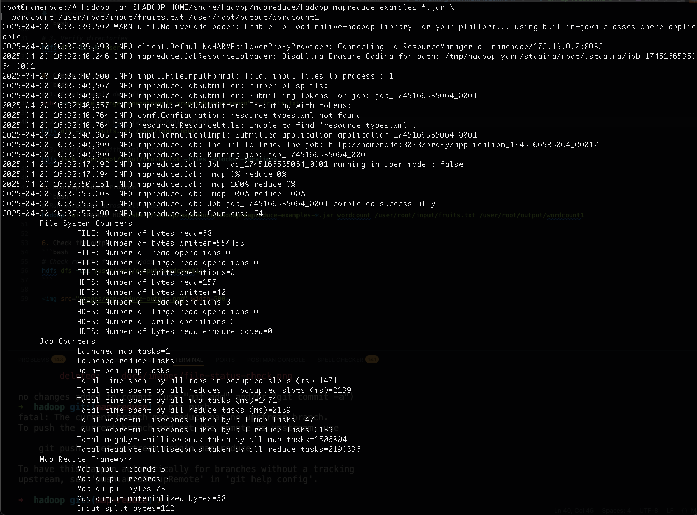
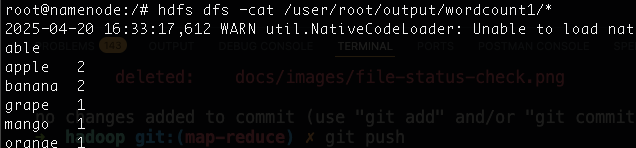

1. Build the container image
```bash
docker up -d --build
```

2. Verify the Cluster Health
```bash
# Check running services (should show all components)
docker exec namenode jps
# Expected:
# 1. NameNode
# 2. ResourceManager
# 3. NodeManager

# Check datanode registration
docker exec namenode hdfs dfsadmin -report
# Should show all 3 datanodes as "Live"
```

3.  Create HDFS Directory Structure First
```bash
# 1. Enter the NameNode container
docker exec -it namenode bash

# 2. Create directory structure in HDFS (run these INSIDE the container)
hdfs dfs -mkdir -p /user/root/input
hdfs dfs -mkdir -p /user/root/output
hdfs dfs -chown -R root:root /user/root
hdfs dfs -chmod -R 755 /user

# 3. Verify directories
hdfs dfs -ls -R /user
```

4. Create Toy Data
```bash
# 1. Create sample data file
echo -e "apple orange banana\napple grape\nbanana mango" > fruits.txt

# 2. Put file into HDFS 
hdfs dfs -put fruits.txt /user/root/input/

# 3. Verify file with replication
hdfs fsck /user/root/input/fruits.txt -files -blocks -locations
```

5. Run Map Reduce Program
```bash
# Run WordCount across all nodes
hadoop jar $HADOOP_HOME/share/hadoop/mapreduce/hadoop-mapreduce-examples-*.jar wordcount /user/root/input/fruits.txt /user/root/output/wordcount1
```


6. Check the output
```bash
# Check results from all nodes
hdfs dfs -cat /user/root/output/wordcount1/*
```

